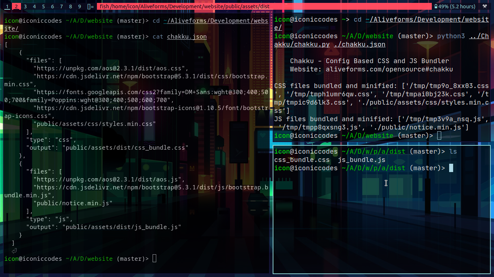

# Chakku by Aliveforms - CSS and JS Bundler

An FOSS Tool by Aliveforms -
[https://aliveforms.com](https://aliveforms.com)


Chakku is a simple tool for bundling and minifying CSS and JS files. It reads a configuration file to specify input files, types, and output file names. Chakku supports both local and online files.



### Installation

1. Clone the repository:
```
git clone https://github.com/nabeelalihashmi/chakku.git

cd chakku
```

2. Install dependencies:
```
pip install beautifulsoup4 requests csscompressor jsmin
```

### Usage

1. Create a chakku.json file with your configuration:
```
[
    {
    "files": ["path/to/style1.css", "path/to/style2.css"],
    "type": "css",
    "output": "dist/bundle.css"
    },
    {
    "files": ["path/to/script1.js", "path/to/script2.js"],
    "type": "js",
    "output": "dist/bundle.js"
    }
]
```

2. Run Chakku:
```
python path/to/chakku.py path/to/chakku.json
```

### Configuration

The chakku.json file contains an array of configuration objects. Each object specifies:

- "files": An array of input file paths (local or online).
- "type": The file type ("css" or "js").
- "output": The output file path.

### Website

aliveforms.com/opensource#chakku.

### About Aliveforms
Aliveforms 
[https://aliveforms.com](https://aliveforms.com)
 is an online form builder to create forms, quizzes, surveys, polls, giveaway raffles and more. It works on all modern devices like phones, tables and computers. Aliveforms supports logic, themes, integrations with services like Google Sheets, Google Drive, Zapier, MailChimp, Pabbly Connect and more.

### License

This project is licensed under the MIT License.
